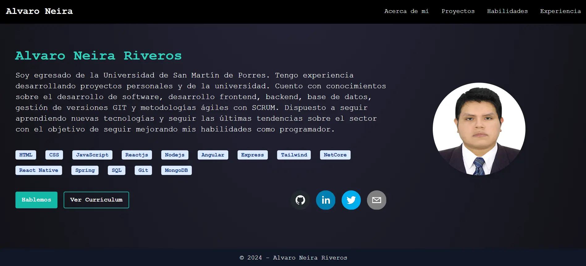
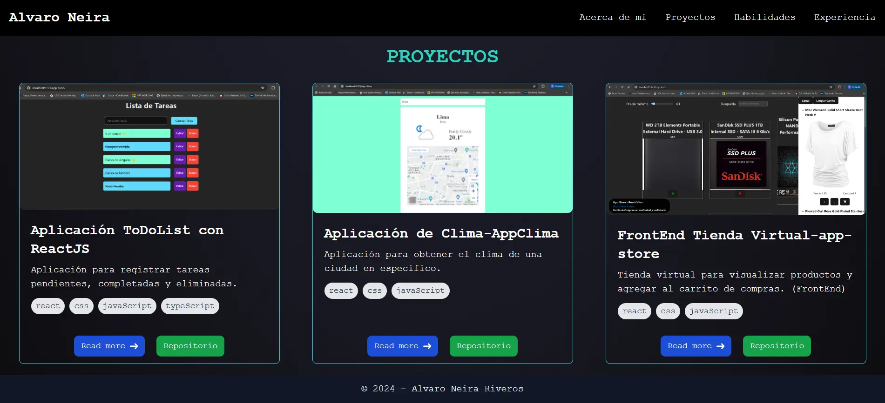
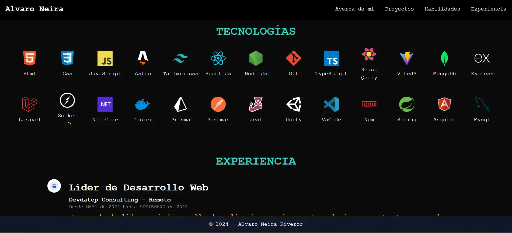

# 📱 Portafolio Personal donde subiré los proyectos que vaya realizando.
Bienvenido a mi portafolio personal, una página donde comparto información sobre mí, mis habilidades y los proyectos que he desarrollado y experiencias. Cada proyecto incluye una descripción, tecnologías utilizadas y un enlace a su repositorio en GitHub. Si el proyecto es una aplicación web, también encontrarás un enlace para verlo en línea.

---

## 📷 Vistas del portafolio







---
## 🚀 Tecnologías y Herramientas utilizados en el proyecto:


###  🧱 Lenguajes y marcos de trabajo:
>  HTML
 CSS
 TypeScript  


###  Frameworks y librerías:

>  TailwindCSS
>  React
>  Astro


###   Dependencias de desarrollo:
>  Flowbite
>  tailwind


### Herramientas de desarrollo:
>  Visual Studio Code
>  GitHub
>  Figma


---

## 📁 Estructura de carpetas

```
.
├── public
│   ├── portfolio-icon.png
│   └── CV.pdf
│   ├── img
├── src
│   ├── components
│   │   ├── footer.astro
│   │   ├── header.astro
│   │   ├── main.astro
│   │   └── pages.astro
│   ├── const
│   │   ├── const.js
│   ├── icons
│   ├── layouts
│   │   ├── Layout.astro
│   ├── pages
│   │   ├── project
│   │   ├── index.astro
├── .gitignore
├── astro.config.mjs
├── package.json
├── README.md
└── tailwind.config.mjs
└── tsconfig.json
```

---

## 🧪 Cómo ver el sitio

Puede ingresar al siguiente enlace para ver el sitio web:

🔗[Portafolio Personal](https://portfolio-alvaro-neira-git-master-alvaro-neiras-projects.vercel.app/)

---

## 🧰 Instalación local

1. Clona el repositorio:

   ```bash
   git clone https://github.com/Neira21/portfolio-alvaro-neira.git

   npm install

   npm run dev

2. Accede a la aplicación en tu navegador:

   ```bash
   http://localhost:4321

---

## 📝 Autor

- [@alvaro-neira](https://github.com/Neira21)

---


